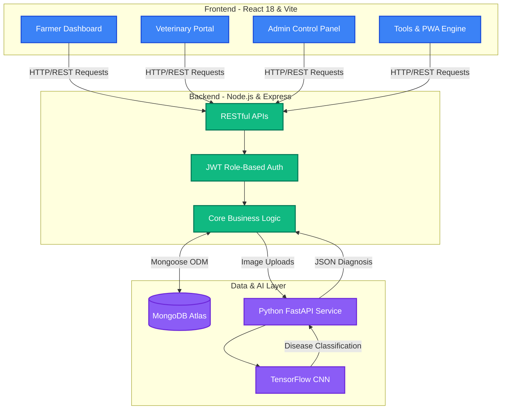
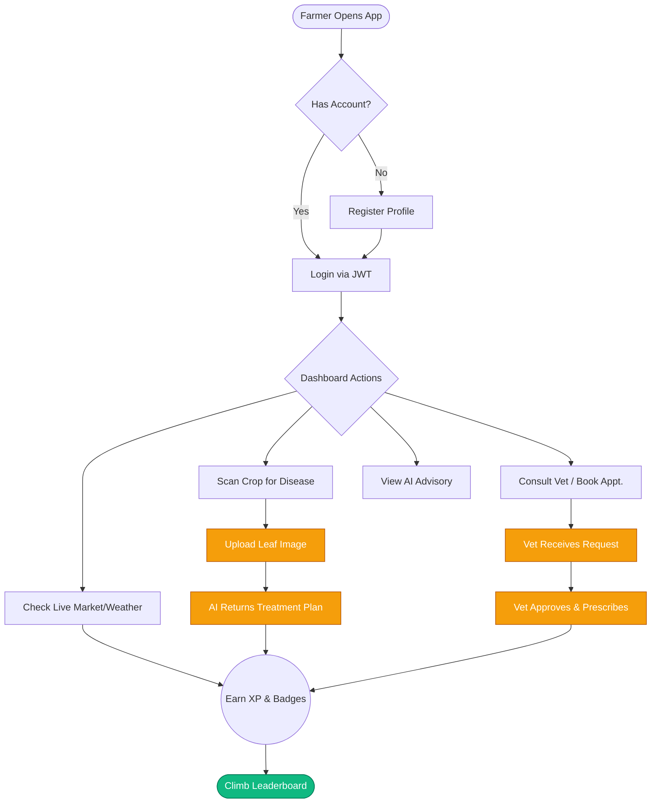

# 🌱 AgriVerse: The Future of Smart Farming

<div align="center">
  <strong>Empowering India's 140 Million Farmers with AI, Gamification & Real-Time Intelligence</strong><br>
  <em>A full-stack, multilingual, offline-capable smart farming ecosystem designed for accessibility and impact.</em>
</div>

<br>

<div align="center">
  <a href="https://agriverse-bwqw.onrender.com"></a>
  
  
  
</div>

---

## 🎯 Executive Summary & Problem Statement

India's agricultural sector accounts for 18% of GDP and employs 44% of the workforce, yet small and marginal farmers remain chronically underserved by technology. 

| Challenge | Scale |
| :--- | :--- |
| **Lack of personalized advisory** | 140M+ small & marginal farmers have no agronomist access |
| **Market price opacity** | Middlemen capture 30–40% of farm-gate value |
| **Late pest & disease detection** | Annual crop losses estimated at ₹80,000+ crore |
| **Digital accessibility barriers** | Low literacy + inconsistent internet in rural areas |
| **No veterinary access** | Massive livestock healthcare gap in rural India |

**The Solution:**
AgriVerse is a unified, one-stop platform that solves all these challenges. It combines AI crop advisory, real-time market/weather data, machine-learning pest detection, IoT telemetry, gamified learning, and a dedicated veterinary consultation portal into a single Progressive Web App (PWA) that works offline and supports multiple regional languages.

---

## 🏗️ System Architecture

AgriVerse employs a modern, decoupled client-server architecture, deployed entirely on the cloud.



---

## 🔄 User Journey & Flowchart

The platform is designed to be intuitive and gamified, turning best farming practices into rewarding daily habits.



---

## 💻 Technology Stack

| Layer | Technology | Purpose |
| :--- | :--- | :--- |
| **Frontend Framework** | React 18 + Vite + TypeScript | Core UI with fast HMR |
| **Styling** | TailwindCSS + CSS Variables | Design system + glassmorphism |
| **UI Primitives** | Radix UI + shadcn/ui | Accessible, headless components (50+) |
| **Data Visualization** | Recharts | Analytics charts (Line, Bar, Radar) |
| **Backend Runtime** | Node.js + Express | REST API server |
| **Database** | MongoDB Atlas + Mongoose | Cloud persistent storage |
| **Authentication** | JWT + bcryptjs | Stateless role-based auth (farmer/vet/admin) |
| **AI Service** | Python + FastAPI + TensorFlow | ML model API server for disease detection |
| **PWA** | vite-plugin-pwa + Workbox | Offline caching + installability |
| **Hosting** | Render.com | Full-stack cloud deployment |

---

## 🗺️ Pages & Routes

| Route | Access | Description |
| :--- | :--- | :--- |
| `/` | Public | Landing page with featured tools |
| `/login` | Public | Registration and JWT authentication |
| `/dashboard` | Farmer | Core farmer dashboard (7 tabs) |
| `/tools` | Farmer | Tools & Insights (IoT/Drone/Chain/PDF) |
| `/vet` | Vet | Vet consultation & advisory management |
| `/admin` | Admin | Platform admin panel |
| `/amu` | Vet / Admin | AMU blockchain ledger |
| `/leaderboard` | Authenticated | Community XP rankings with podium |
| `/marketplace` | Authenticated | Farmer-to-Consumer produce exchange |
| `/calendar` | Authenticated | Seasonal sowing & harvest planner |

---

## ✨ Feature Deep-Dive

### 1. 🤖 AI Disease Detection & Smart Advisory
- **Crop Disease AI:** Upload a photo of a diseased crop leaf. Our Python FastAPI service uses a CNN to identify the disease and return an actionable treatment plan.
- **Predictive Pest Alert:** 14-day forecast calculating outbreak likelihood based on weather patterns and historical data.
- **Voice-Enabled Chatbot:** Multilingual conversational Q&A with Web Speech API voice input for low-literacy users.

### 2. 🎮 Gamification Engine
- **Daily Missions:** 8 auto-resetting missions assigned each day.
- **XP & Leveling:** Complete tasks to earn XP and unlock badges (e.g., Green Thumb, Market Guru).
- **Leaderboard:** Animated Gold/Silver/Bronze podium for top farmers globally.

### 3. 🩺 Integrated Veterinary Portal
- **Farmer Inbox:** Submit consultation requests, book appointments, and track status.
- **Vet Dashboard:** Manage patient queue, approve appointments, and broadcast health advisories.

### 4. 📊 Real-Time Analytics Dashboards
- **Overview:** KPI cards, grouped bar charts, radar charts.
- **Crop Performance & Soil Health:** Track moisture, nitrogen, pH, and yield over 30 days.

### 5. 🛠️ Advanced Farming Tools
- **IoT Dashboard:** Live simulated telemetry (moisture, temp, pH) with auto-refresh and alerts.
- **Drone Aerial Analysis:** Drag-and-drop aerial imagery for NDVI scoring and waterlogging risks.
- **Produce Blockchain:** Tamper-evident ledger to trace harvests and Antimicrobial Usage (AMU).
- **Gov Scheme Finder:** Match with PM-KISAN, PMFBY, etc. based on land-size.
- **PDF Report Generation:** One-click A4 farm report download via jsPDF.

### 6. 🌐 Multilingual & Accessible
- **3 UI Languages:** Switch instantly between English, Hindi (हिंदी), and Odia (ଓଡ଼ିଆ).
- **PWA:** Installable directly to mobile home screens with offline caching capabilities.

### 7. 🛒 F2C Community Marketplace
- **Direct Trade:** Eliminate middlemen through Farmer-to-Consumer commerce.
- **Contact:** One-click WhatsApp deeplinks and UPI payment initiation.

---

## 🗄️ Data Models (MongoDB)

| Model | Key Fields |
| :--- | :--- |
| `Farmer` | name, email, password, phone, soilType, landSize, role |
| `Advisory` | farmerId, crop, summary, fertilizer, irrigation, pest |
| `DrugLog` | animalId, drugName, dosage, withdrawalDays, applicator |
| `Consultation` | farmerId, vetId, animalId, disease, message, status |
| `Listing` | farmerId, cropName, quantity, price, category, organic |

---

## 🚀 How to Run Locally

1. **Clone the repository:**
   ```bash
   git clone https://github.com/Puspaldas17/Smart-Crop-Tools.git
   cd Smart-Crop-Tools
   ```

2. **Install dependencies:**
   ```bash
   npm install
   ```

3. **Set up Environment Variables:**
   Create a `.env` file in the root directory and add your MongoDB URI:
   ```env
   MONGODB_URI=mongodb+srv://<username>:<password>@cluster0.mongodb.net/agriverse
   JWT_SECRET=your_super_secret_jwt_key_here
   ```

4. **Start the Development Server:**
   ```bash
   npm run dev
   ```
   *The app will automatically compile both the React frontend and Express backend, making it available at `http://localhost:8080`.*

---

## 🌟 What Differentiates AgriVerse

- **Voice-First Interface:** Removes literacy barrier; farmers speak, not type.
- **Predictive Over Reactive:** 14-Day predictive pest forecast warns farmers ahead of time.
- **Offline-First PWA:** Usable in areas with intermittent internet connectivity.
- **Unified Ecosystem:** Weather + Soil + AI + Market + Vet + Community all in one app.

---

## 📝 License & Developer

Developed by **Puspal Das** (SOA University, ITER) for SIH 2024.  
[GitHub Profile](https://github.com/Puspaldas17) | [Live Application](https://agriverse-bwqw.onrender.com)

*Licensed under the MIT License — open source for the benefit of India's farming community.*
